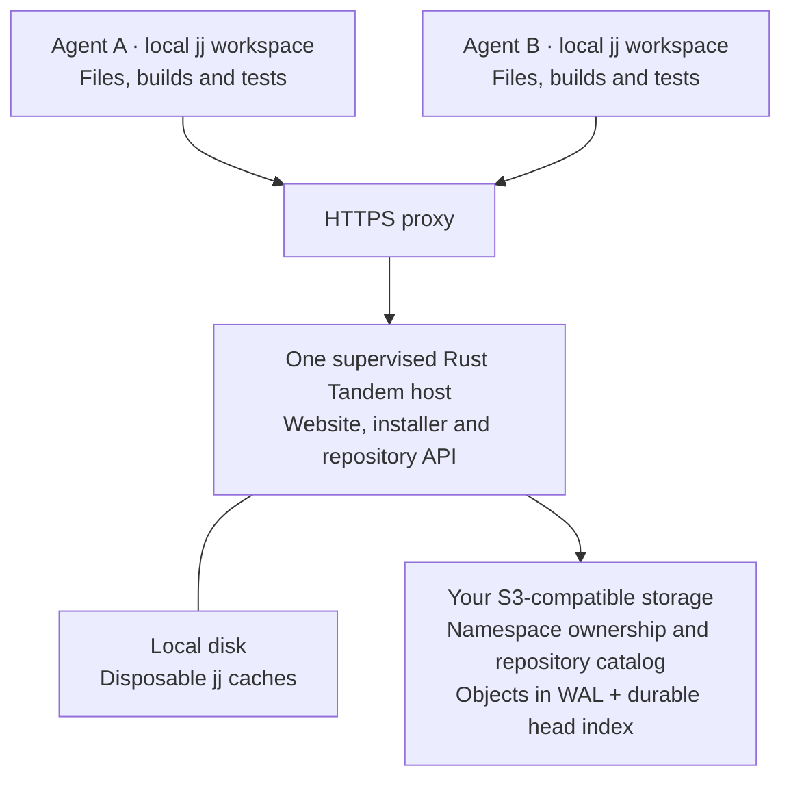

# Tandem

Tandem gives coding agents **local jj workspaces with shared history**.
Agents work on the same project from different machines. Each keeps its own
files, builds and tests; published changes become visible to the others.

The `td` and `tandem` commands are the same binary. It embeds
[Jujutsu](https://jj-vcs.github.io/jj/latest/), with remote stores for shared
history. Ordinary jj commands remain ordinary jj commands.

Use [tandem.land](https://tandem.land), or [run your own native Rust host with
an S3-compatible bucket](docs/self-hosting.md).

## Get started on tandem.land

The hosted installer supports GNU/Linux x86_64 and saves an owner credential
for this host. Replace `you` with your namespace and `my-project` with your
repository name; the first clone creates them when needed.

```bash
curl -fsSL https://tandem.land/install | sh
export PATH="$HOME/.local/bin:$PATH"
td clone https://tandem.land/you/my-project my-project --workspace agent-a
cd my-project
td daemon .
```

Keep the daemon running. In another terminal in that workspace:

```bash
printf 'hello from agent-a\n' > hello.txt
td diff
td describe -m 'Add a greeting'
td log
td bookmark create agent-a/greeting -r @
```

Give each additional agent a distinct workspace and a scoped credential for
this repository. An independently installed owner credential does not grant
access to somebody else's namespace. The [access instructions](docs/self-hosting.md)
show how the owner provisions agents without sharing its own credential.
After receiving its credential through `TANDEM_TOKEN`, agent B can clone and
read A's published file:

```bash
td clone https://tandem.land/you/my-project my-project --workspace agent-b
cd my-project
td file show --ignore-working-copy -r 'agent-a@' hello.txt
td daemon .
```

For other platforms or a source installation, build this checkout:

```bash
cargo build --locked --release -p jj-tandem --bin tandem
```

Use `target/release/tandem` in place of `td`. Source-built clients can obtain
an owner credential using the self-hosting guide; building a binary does not
provision access. Run `tandem --help` for the current command reference.

## Architecture



The daemon prepares snapshots through jj and publishes each graph in one
combined mutation request. The host validates it and persists the WAL and
head index before acknowledging. Warm repositories reuse cached history;
an empty host cache is reconstructed from the bucket.

Concurrent history survives. Stacked rewrites can produce divergent jj
versions, which you inspect and resolve with jj. The daemon marks a workspace
stale when its checked-out commit moves elsewhere and leaves its files alone;
you choose when to run `td workspace update-stale`.

The complete state ownership and publish boundaries are in
[ARCHITECTURE.md](ARCHITECTURE.md) and [the reliability contract](docs/reliability.md).

## Host it yourself

Run the same native host on your own machine with an independently durable
S3-compatible bucket, a protected signing secret and an HTTPS reverse proxy.
Cloudflare and exe.dev are choices for tandem.land, not requirements for
self-hosting. The current hosted service runs in Frankfurt with R2 in Western
Europe.

The [self-hosting guide](docs/self-hosting.md) includes:

- A source build and supervised systemd service.
- Configuration for your own S3 endpoint and bucket.
- A local Docker S3 example for trying the setup.
- Owner and workspace credentials, exact-file verification and cold recovery.

Run one active host. Preserve signing secrets and deployment configuration
outside its disposable cache. A Docker bucket on the same machine is a local
demo; it cannot protect data against losing that machine.

[Operations](docs/operations.md) covers deployment, monitoring, backups and
replacement. [Agent image instructions](docs/images/README.md) cover reusable
client workspaces.

## Development

```bash
python3 scripts/check_docs.py
cargo test --workspace
```

Read [AGENTS.md](AGENTS.md) before changing the repository. Benchmark methods
and retained measurements are in [docs/benchmarks/README.md](docs/benchmarks/README.md).

License: MIT.
